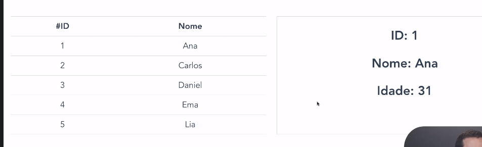

# comunicacao-desafio

### 📚 Aprendizado
Aprender comunicação de dados entre componentes e explorar todas as possibilidades.

### 🎯 Objetivo
Renderizar uma tela de usuário com alguns nomes e na outra tela, mostrar a informação de:
- Id
- Nome
- Idade



<br>

➡️ __Versão Vue.JS:__ ~2 <br>
➡️ __Versão Node.JS:__ ^16


### Iniciar Projeto
```
npm install
```

### Compilar Projeto
```
npm run serve
```
